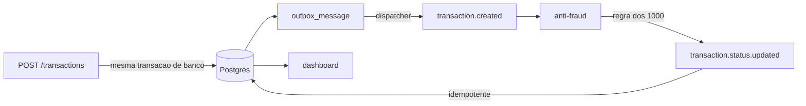

# Transações com validação antifraude assíncrona

Duas aplicações NestJS conversando apenas por Kafka, e um dashboard Next.js sobre elas. A
transação nasce `pendente`, é avaliada por um serviço independente e muda de status fora do ciclo
de requisição de quem a criou.

As decisões estruturantes e o porquê de cada uma estão em [DECISIONS.md](./DECISIONS.md).

- [O que foi construído](#o-que-foi-construído)
- [Como rodar](#como-rodar)
- [Como testar](#como-testar)
- [Verificação manual do fluxo assíncrono](#verificação-manual-do-fluxo-assíncrono)
- [O que ficou de fora](#o-que-ficou-de-fora)

## O que foi construído

```
apps/
  transactions/   API HTTP, dispatcher do outbox e consumo do resultado da avaliação
  anti-fraud/     avalia a transação e publica o veredito. Não tem banco
  web/            dashboard: listagem, detalhe e criação
packages/
  contracts/      envelope e schemas Zod dos eventos e da API, usados pelas duas pontas
  messaging/      produtor, criação de tópicos e o runner de consumo com DLQ
```

### Fluxo



A criação grava a transação e o evento no mesmo `COMMIT`, então não existe instante em que a
transação está salva e o evento perdido. Um dispatcher publica esse evento fora do caminho da
requisição, com recuo exponencial se o broker estiver fora. O consumo do resultado é idempotente:
o `eventId` é registrado na mesma transação que aplica o status, e entrega duplicada não tem
efeito.

### Endpoints

| Rota                                   | Método | O que faz                                                |
| -------------------------------------- | ------ | -------------------------------------------------------- |
| `/transactions`                        | POST   | Registra como `pendente` e enfileira o evento de criação |
| `/transactions/:transactionExternalId` | GET    | Recupera uma transação                                   |
| `/transactions`                        | GET    | Listagem paginada, com filtros de status, tipo e período |
| `/health`                              | GET    | `transactions` verifica o banco; `anti-fraud` é liveness |

### Telas

| Rota                       | O que faz                                                                              |
| -------------------------- | -------------------------------------------------------------------------------------- |
| `/`                        | Listagem paginada com filtros na URL e atualização automática enquanto houver pendente |
| `/transacoes/[externalId]` | Detalhe, incluindo a data da última alteração                                          |
| `/transacoes/nova`         | Criação por formulário, validado pelo mesmo schema do backend                          |

## Como rodar

Requisitos: **Node 22+** (há um `.nvmrc`), **pnpm** e **Docker**.

```bash
# 1. configuração e dependências
cp .env.example .env
corepack enable pnpm   # ou: npm i -g pnpm
pnpm install

# 2. infraestrutura: Postgres, Kafka e Kafka UI
docker compose up -d

# 3. banco de dados
pnpm --filter @challenge/transactions run prisma:deploy

# 4. as três aplicações, cada uma no seu terminal
pnpm --filter @challenge/transactions run dev   # http://localhost:3001
pnpm --filter @challenge/anti-fraud   run dev   # http://localhost:3002
pnpm --filter @challenge/web          run dev   # http://localhost:3000
```

O dashboard fica em http://localhost:3000 e o Kafka UI em http://localhost:8080.

A ordem de subida não importa: se o Kafka ainda não estiver pronto, os serviços avisam e tentam
de novo, e a API aceita criação mesmo com o broker fora.

## Como testar

```bash
pnpm quality   # formatação, build, lint, checagem de tipos e testes
```

Cada etapa também roda isolada, para o ciclo curto:

```bash
pnpm format:check
pnpm build
pnpm lint
pnpm typecheck
pnpm test
```

São 210 testes. Onde eles estão e o que cobrem:

| Onde                 | O que                                                                                                                      |
| -------------------- | -------------------------------------------------------------------------------------------------------------------------- |
| `packages/contracts` | Limites de valor monetário, envelope dos eventos, filtros de listagem e o uuidv5 determinístico contra o vetor da RFC 4122 |
| `packages/messaging` | A decisão de confirmar ou não o offset: sucesso, falha definitiva para a DLQ, falha transitória relançada                  |
| `apps/anti-fraud`    | A regra dos 1000 em centavos inteiros, incluindo 999.99, 1000 e 1000.01, e o determinismo do `eventId`                     |
| `apps/transactions`  | Transação e evento na mesma transação de banco, dispatcher com recuo, idempotência, máquina de estado e filtros            |
| `apps/web`           | As três telas com carregamento, erro, vazio e sucesso, filtros na URL e o polling ligando e desligando                     |

O `build` vem antes de `lint` e `typecheck` de propósito: `packages/contracts` expõe tipos de
`dist/`, que numa clonagem nova ainda não existe.

## Verificação manual do fluxo assíncrono

Nenhum teste automatizado exercita os dois serviços com Kafka e Postgres reais — a escolha e o
motivo estão no `DECISIONS.md`. Este é o roteiro que cobre essa lacuna.

### 1. A transação muda de status sozinha

Com as três aplicações rodando, crie transações nos limites da regra:

```bash
for v in 120 1000 1000.01 1500; do
  curl -s -X POST http://localhost:3001/transactions \
    -H 'Content-Type: application/json' \
    -d "{\"accountExternalIdDebit\":\"3fa85f64-5717-4562-b3fc-2c963f66afa6\",
         \"accountExternalIdCredit\":\"0f8fad5b-d9cb-469f-a165-70867728950e\",
         \"transferTypeId\":1,\"value\":$v}"
done
```

Todas respondem `pendente`. Abra http://localhost:3000 e **não recarregue**: em segundos, 120 e
1000 viram `aprovada`, 1000.01 e 1500 viram `rejeitada`. O limite é inclusivo, como o enunciado
pede.

### 2. A criação não depende do Kafka

```bash
docker stop challenge-kafka
```

Crie outra transação: ela responde `201`. A linha correspondente em `outbox_message` fica com
`published_at` nulo e `attempts` subindo com recuo exponencial:

```bash
docker exec challenge-postgres psql -U postgres -d challenge \
  -c "select attempts, published_at is not null as publicada, left(last_error,40) from outbox_message;"
```

Religue o broker e a transação é avaliada sem nenhuma intervenção:

```bash
docker start challenge-kafka
```

### 3. Entrega duplicada não tem efeito

Este teste planta uma divergência de propósito — sem isso, um resultado igual não provaria nada.
Pare o serviço de transações, altere um status na mão e rebobine o offset do grupo:

```bash
docker exec challenge-postgres psql -U postgres -d challenge \
  -c "update transaction set status='PENDENTE' where value=1500;"

docker exec challenge-kafka kafka-consumer-groups --bootstrap-server localhost:9092 \
  --group transactions-consumer --topic transaction.status.updated \
  --reset-offsets --to-earliest --execute
```

Suba o serviço de novo. Os eventos são reentregues, o log mostra `ja processado, descartando
duplicata`, e a transação de 1500 **continua pendente** — a guarda barrou o reprocessamento em vez
de reaplicar o efeito.

### 4. Mensagem sem destino vai para a DLQ

Publique um veredito para uma transação que não existe:

```bash
echo '{"eventId":"11111111-1111-5111-8111-111111111111","eventName":"transaction.status.updated","eventVersion":1,"occurredAt":"2026-08-23T12:00:00.000Z","payload":{"transactionExternalId":"22222222-2222-4222-8222-222222222222","status":"APROVADA","reason":"orfao"}}' \
  | docker exec -i challenge-kafka kafka-console-producer \
      --bootstrap-server localhost:9092 --topic transaction.status.updated
```

A mensagem aparece em `transaction.status.updated.dlq` com `attempts: 1` — erro definitivo vai
direto, sem retentar — e com o envelope original preservado:

```bash
docker exec challenge-kafka kafka-console-consumer --bootstrap-server localhost:9092 \
  --topic transaction.status.updated.dlq --from-beginning --max-messages 1
```

## O que ficou de fora

**Testes de ponta a ponta com Kafka e Postgres reais.** É a única prova automatizada do fluxo
assíncrono, e o preço é subida lenta no CI e intermitência. A lacuna é coberta pelo roteiro manual
acima.

**Observabilidade da outbox.** É o furo mais relevante da arquitetura: o health fica verde
enquanto a outbox cresce sem publicar. Em produção isso precisa de alerta sobre a contagem de
mensagens não publicadas e sobre o lag do grupo de consumidores.

**Paginação por chave.** A listagem usa `LIMIT/OFFSET` com `COUNT`, que degrada em página
profunda. O dashboard pede número de páginas, e trocar sem volume medido seria otimizar por
palpite. O raciocínio completo está na resposta sobre volume alto no `DECISIONS.md`.

**Autenticação e autorização.** O enunciado não pede, e nenhum endpoint tem dono.

**Expurgo da outbox.** As mensagens publicadas ficam na tabela. O índice parcial mantém a busca
rápida, mas a tabela cresce indefinidamente.

**Cadastro de tipos de transferência.** Os três tipos vêm por migration. Não há endpoint para
criar tipos novos, porque nada no enunciado precisa disso.

**Dispatcher no mesmo processo da API.** Ele compete por recursos com o tráfego HTTP. Como usa
`FOR UPDATE SKIP LOCKED`, tirá-lo para um processo próprio é mudança de deploy, não de código.
